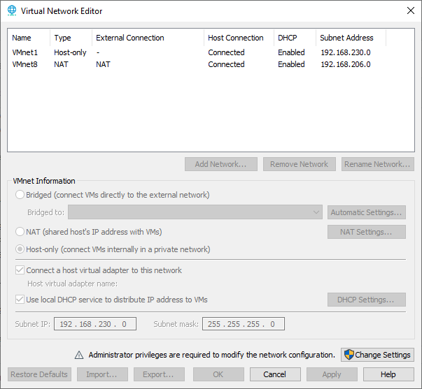
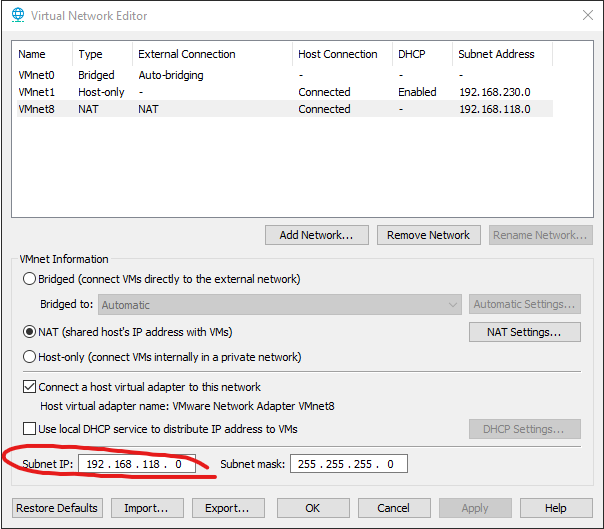
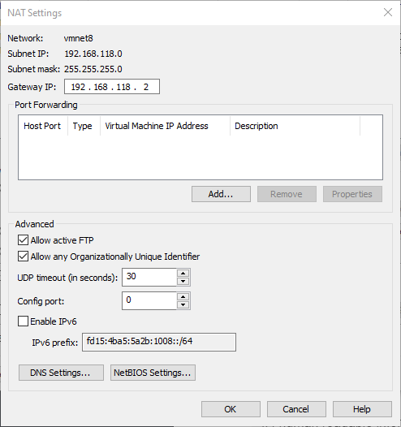
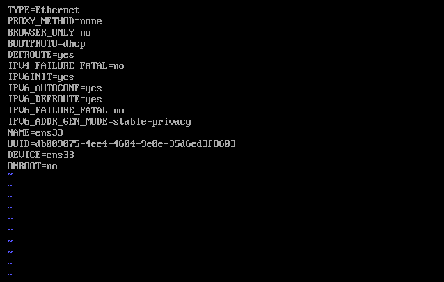
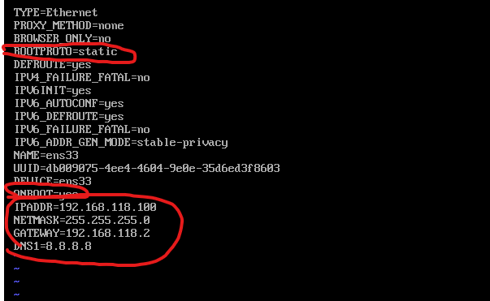
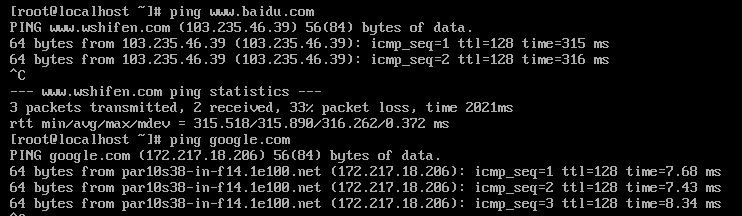

# Linux study notes
Here I take notes for the [video course Linux operating system](https://www.bilibili.com/video/BV1zL411T7YY) (in Chinese). This course is intent for server setup.

## Virtual machine network configurations

### Virtual network editor
Virtual network editor in VMware shows the subnet IP address of the virtual machine.

We can customize our subnet IP address and uncheck the DHCP service, since we are going to set up a static IP.

We should also click on the NAT settings to check the gateway IP.

In this case it's 192.168.118.2

### Set up config file in virtual machine
The directory is `/etc/sysconfig/network-scripts/ifcfg-ens33`. We use `vi` to edit the file. The original file is like the following.

We will change ONBOOT to yes, BOOTPROTO to static, then add IPADDR, NETMASK, GATEWAY and DNS1. The following is the edited file.

Then restart the network service by `systemctl restart network.service`. Now we can ping baidu and google to test the network:

## File system commands

### `df` and `du`
- `df`: partition information
  - `-h`: human readable information
- `du`: specified file size
  - `--max-depth`: depth of search

### compress and decompress
- `.tar.gz`: most linux compressed files are in this format
  - `tar -zxvf filename`: extract `.tar.gz`, `zx` is decompress, `v` is verbose and `f` is file.
  - `tar -zcvf target_file source_file`: compress `source_file` into `target_file`, `zc` is compress
- `zip` and `unzip`
  - need installation with `yum`
  - `zip -r target source`
  - `unzip filename`
