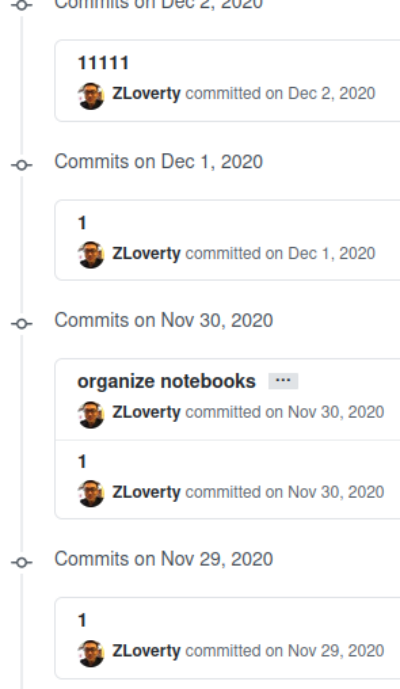
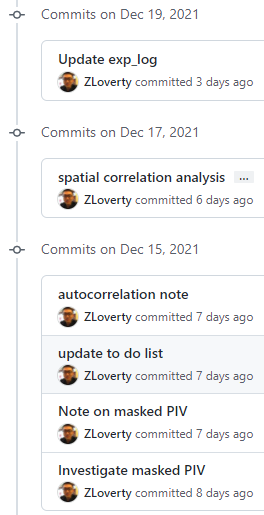

# Focusing, prioritizing and being realistic

How many things can I do a day?
I used to think I can read two papers in the morning.
In the mean time, I can prepare the experiment in the afternoon.
After the experiment, I can analyze all the data with my "miraculous" code with just a click.
I can even have fun in the evening!
It looks like, I can have such a "fruitful" day as a researcher, without spending much time.
However, this was just a daydream which I had from time to time in the past several years.

Because of these daydreams of automating my workflow, I spent time learning programming, in various languages.
From undergrad research, to getting a PhD degree, I have learned to use Fortran, Matlab, Python.
There were also languages I tried to learn, but ended up not using them for work, like Lisp, C++ and JAVA.
The time I spent on them, unfortunately, may never pay off.

At the time I write this article, I try to think about a question:
back in the days when I don't know anything about programming, what was driving me to learn?
I think it was the eager to learn something that people around me are not familiar with, so I can show off.
When people walk by and see, they may say "wow it's cool".
But this really is not a good motivation to learn. It is a force from outside and does not sustain well when I encounter hard problems.

I seem to get lost in regretting about the time I wasted in the past.
And I just recall that, in this article, I want to rethink about *focusing*.
So how to focus?
I have never tried to seek advice from other people on how to focus, so what I write here may not be a comprehensive review.
Personally, I am more efficient when I do not try to do many different things at the same time.
I still remember the AI course I dropped when I was an undergraduate student.
In the first class, I was told that Python was the programming language to use for the course homework.
I had no experience in Python before the course, so I quickly started to read basic Python tutorials for a few days.
The basics were not too different from other programming languages, and I thought I grasped them.
Then in the second class, I got the first homework assignment of the course.
It was a mini "video game" written in Python, consisting of 5 or 6 .py files.
Each file had about ten functions in it.
I started to examine the code line by line, using the knowledge I learned from the tutorials.
Very soon, I felt I was overwhelmed: it was a jump from basic data types directly to coding an application.
I tried to learn how to write functions, how to import modules, how to set environment variables in Windows.
But after all these effort, I was not able to understand the majority of the source code.
Things became scary when I found that on the day I was supposed to submit the homework, I had not started working on it.
The failure to comprehend the code frustrated me a lot and I eventually dropped the course.

Recall this experience, I do not regret the time I spent on learning everything on Python because those knowledge is still benefiting me.
However, I do regret for not being able to continue the course back then.
If I could focus more on the assignment itself, instead of grinding the technical details of the source code, I should be able to make it through.
And if I did manage to complete the course, I would have learned far more than a few technical tips of Python.
My effort was not completely wasted, but it could be more worthwhile if I know how to prioritize my tasks.
At the moment when I write this article, I am still not confident enough to say I know how to prioritize things.
But I realize that I should be vigilant not to go into infinite details.
It has happened to me many times when I read a document and click a link in the document which explains certain aspects in detail.
Eventually, links after links, I forget what I was originally reading about, and tons of information overwhelmed my memory.
Knowing everything is certainly good, but is also simply impossible.

After realizing this issue, I have been thinking what I can do to help myself focus.
One thing I am trying is to write a **note** whenever I want to do something.
For example, I want to test a hypothesis in an experiment, I will start a note by describing the hypothesis, and follow up with experimental results.
Coding is usually necessary when analyzing experimental results, and is the part where I usually got distracted (because I want to automate the analysis).
The note, in this case, can keep remind me not to spend too much time on coding, but to aim at getting results.

I also feel that using command line more helps me stay focusing on things I am working on.
For example, when I used GitHub with the desktop App in the past, every time I commit I simply push everything in my local disk to the server.
Very often, I forget the specific changes I have made in that commit, so in the commit comment I just leave a "1", which means "I don't know".
Below is a bad example I did in the past:

In this way, GitHub has lost the most important functionality but only serves as a cloud storage.
After I started using command line GitHub (I use it because I switched to an Ubuntu desktop and the App is unreasonably slow), I realize a difference:
whenever I make a commit, I have to manually choose the files I want to track changes.
Back then I did not know that by typing `git add .` I can track all files in the working tree.
So I just add the files one by one by typing the names of the files.
When I do this to a latex folder, the byproduct files (like .log .aux etc.) drive me crazy.
Interestingly, this crazy experience makes me more aware of what GitHub is doing in the backend.
I start to use `.gitignore`, which is especially useful for filtering latex byproduct files.
I also start to commit with more descriptive comments, so when going back to file history, I can understand my changes better.

There are two reasons I think command line helps me to focus.
First, in command line I am not enabled to do many things at the very beginning.
Only till I learn many enough commands can I be as powerful as using a GUI.
So at beginning, I can slow down and pay attention to what happens after each command.
In this way, I have a better idea of what GitHub is doing.
Second, the single thread nature of command line interface forces me to finish one thing before starting another.
I happens to me a lot that before making a commit to a code, I start to work on something else.
After some time, I come back, but realize I forget the changes I made and just put "1" as the commit comment.
In command line this can never happen, because whenever commit, a text editor pops up and I have to write the comment before doing other things.

## Edit on Dec 22, 2021

I'm glad that I have the chance to come back to my first and so far only blog to make some updates. Good news is that my GitHub commit message is becoming more and more meaningful. Below is a snapshot:

After using a Ubuntu computer as my main work station for half a year, I have better command line knowledge of Linux and feel more comfortable with terminals and the concept of server/client.

Motivated by the pain of transferring large image data back and forth, from desktop to external drive to laptop, I start to think about a solution that minimizes the file transferring. Up to now, a solution "personal server" has emerged. The concept is that all image data are copied only once (from microscope computer to my office desktop), then all image processing happens in my office desktop (server). Sometimes, I cannot be in the office, but want to access and keep processing the images. In these scenarios, I use `ssh` to remote login the command line and run code on images. Meanwhile, `WinSCP` is used to transfer files from and to the server. In this way, I can select only the most important data to copy to my local "client" computer, and no longer need to worry about storing/transferring large files many times.

Using two computers together to process images has also been made possible by using Network File Sharing (NFS). I wrote a [gist blog](https://gist.github.com/ZLoverty/64f0d5de93d95ea12e98b3010ba37646) on it some time before when I was developing the system. By mounting the file system of main server computer to other server computers by NFS, other computers can access the files stored on the main server as if the files are local.

Remote `ssh` and `SCP` access is made possible by VPN. Using the PMMH VPN, I'm able to login my "personal server" any time, as long as I have access to internet. In the future, after leaving PMMH, I will have to learn how to set up OpenVPN myself.

This setup has been making me excited because it not only integrates computational power for image analysis, but also saves a lot of file transfer time.
