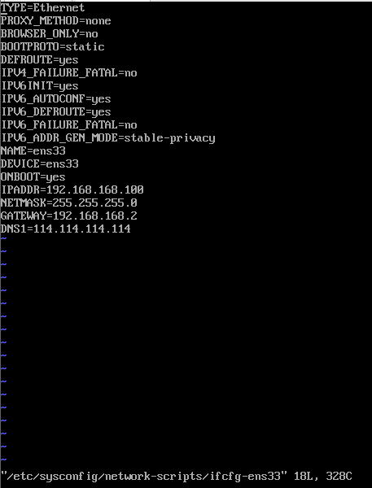
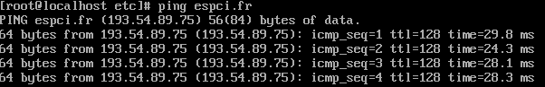

# Learn Linux

Linux has two main branches: **Debian and RedHat**. Debian is meant for personal use, with a popular example Ubuntu. RedHat is meant for server use, with a popular example of CentOS. I'm going to learn the basics of servers, so the distro of interest here will be **CentOS**. The reference of this note is [this video course](https://www.bilibili.com/video/BV1zL411T7YY).

## Virtual Machine

I used to think only when I have many computers can I test out a server. In fact, it only requires a virtual machine, or several virtual machines. I've already set up **VMware** on my laptop.

## First login

A fresh CentOS only has one user: **root**. Set all password to 123456, which is not sensitive and easy to remember.

## IP address and internet
The first thing to do on a minimal operating system is to set up its network, i.e. the ip address. CentOS does not have a graphical interface to set ip address, but this can be done by editing `/etc/sysconfig/network-scripts/ifcfg-ens33`.



There are 4 things:

1. Delete the `UUID=...` line (I don't know why)
2. Set `BOOTPROTO=static`, this makes the system not to automatically configure the network settings, so that our configurations can stay.
3. Set `ONBOOT=yes` to apply configurations on boot.
4. Set `IPADDR`, `NETMASK`, `GATEWAY` and `DNS1`:
  - `IPADDR`: ip address, has to be in the same ip band (IPADDR*NETMASK), the last digit must not be 0, 1 or 255. Safe choice would be anything in 100-200.
  - `NETMASK`: 255.255.255.0 (can this be different?)
  - `GATEWAY`: this has to be consistent with the virtual machine net work settings.
  - `DNS1`: 114.114.114.114 (any other DNS?). When DNS is set, some domain name and ip addresses are linked, so that we do not have to remember the dry ip address, but can use juicier name instead. For example, I can ping the ESPCI domain name with
    ```bash
    ping espci.fr
    ```
    and get the following result
    

## Text file operation
### 1. `more` and `less`
Load one page, allow user to move to other pages. Press `h` to see the commands. `less` has more powerful commands but is mostly the same as `more`.
### 2. `head` and `tail`
Use `-n` to specify how many lines in the head or the tail of the file.
```
head -10 /etc/profile
```
displays the first 10 lines of file `profile`.

A very useful function of `tail` is to monitor the change of a file in real time, such as a system log.
```
tail -f xxx.log
tail -F xxx.log
```
The difference is `-f` monitors the inode, while `-F` monitors the file name.

### 3. `>>`
Write output into a file
```
ping www.baidu.com >> baidu
```
saves the result of ping to file `baidu`.
```
echo 1234 >> example.txt
```

### 4. `vi` notes
- `vi +n xxx`: open xxx and put cursor at nth line
- `I` and `A`: insert / append in the beginning or the end of a line.

## File transfer
### 1. `lrzsz`
Light weight uploading and downloading.
